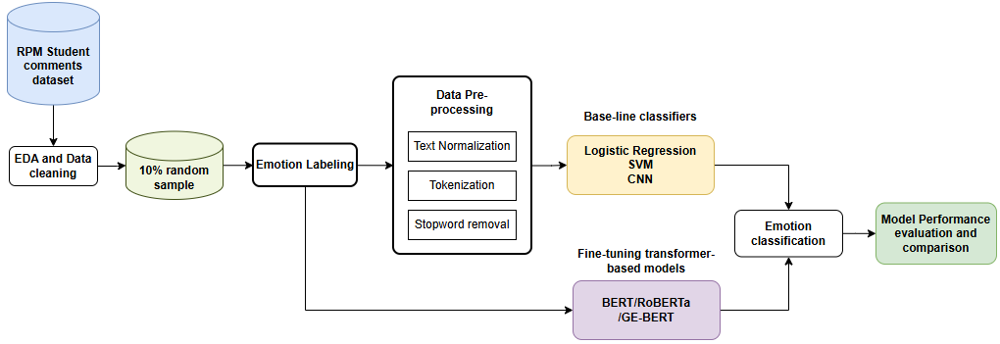
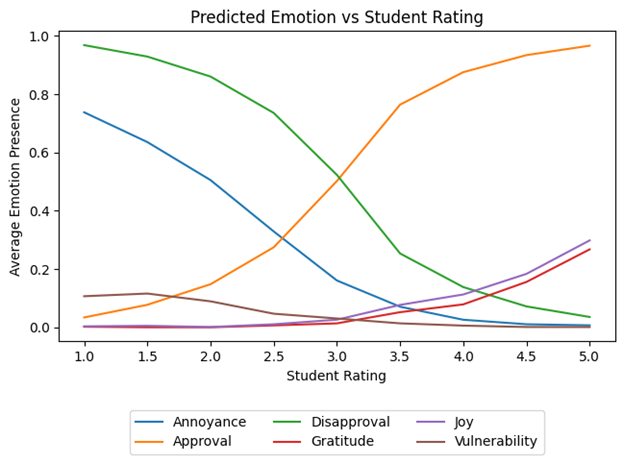

# 🧠 Emotion Detection & Sentiment Analysis in Academic Feedback

A Natural Language Processing (NLP) project that builds a customized emotion taxonomy to analyze student reviews of professors using a combination of Plutchik’s Wheel of Emotions and Google’s GoEmotions framework.

---

## 🎯 Project Overview

This project explores how students emotionally express their academic experiences through course and professor evaluations. Instead of traditional positive/negative sentiment analysis, this work introduces a **fine-grained emotion taxonomy specifically designed for educational feedback**.

The system analyzes real student comments and classifies them into emotional states such as approval, disapproval, gratitude, annoyance, joy, and vulnerability.

---

## 🧠 Key Innovation

- Developed a **custom 6-emotion taxonomy** tailored for academic feedback
- Combined:
  - Plutchik’s Wheel of Emotions (psychological model)
  - Google’s GoEmotions dataset (social-media based model)
- Bridges psychological + contextual NLP emotion modeling

---

## 📊 Dataset

- ~20,000 student reviews (RateMyProfessor dataset)
- 17,000+ unlabeled samples used for large-scale inference
- Human + AI-assisted annotation pipeline

---

## ⚙️ Methodology

- Text preprocessing (tokenization, lemmatization, TF-IDF)
- Baseline models:
  - Logistic Regression
  - SVM
  - CNN (GloVe embeddings)
- Transformer models:
  - BERT
  - RoBERTa (best performing model)
  - GoEmotions fine-tuned BERT
- Multi-label classification framework
- Evaluation using Macro-F1 and Micro-F1 scores

---

## 🏆 Key Results

- 🥇 Best model: **RoBERTa (Twitter-pretrained)**
  - Macro F1: **0.69**
  - Micro F1: **0.84**
- Strong performance in:
  - Approval
  - Disapproval
  - Annoyance
- Weakest class:
  - Vulnerability (low-frequency label)

---
## 📊 Project Results & Visual Insights

### ⚙️ Methodology Workflow

This diagram summarizes the full pipeline of the project, from data collection and preprocessing to model training, evaluation, and inference.

---

### 🎭 Emotion Definitions (Custom Taxonomy)
This diagram shows the custom 6-emotion taxonomy designed specifically for academic feedback, combining Plutchik’s Wheel of Emotions and GoEmotions.

---

### 🤖 Model Performance Comparison

This table compares the performance of baseline models (Logistic Regression, SVM, CNN) against transformer-based models (BERT, RoBERTa, GE-BERT) using F1-scores.

It highlights how transformer models significantly outperform traditional approaches, especially in context-heavy emotion classes.

---

### 📈 Emotion vs Student Rating

This visualization shows how predicted emotions correlate with student ratings. Higher ratings are associated with positive emotions like approval and gratitude, while lower ratings align with disapproval and annoyance.

---

## 📈 Insights

- Students express **more approval than negativity overall**
- Negative emotions strongly correlate with low ratings
- Subtle emotions (annoyance, vulnerability) require transformer models
- Lexical models perform well only for explicit sentiment (approval/disapproval)

---

## 🧪 Technologies Used

- Python
- Pandas, NumPy
- Scikit-learn
- TensorFlow / PyTorch (if applicable)
- HuggingFace Transformers
- Google Colab

---

## 📂 Notebook

All experiments were developed in Google Colab:
- Data preprocessing
- Model training
- Evaluation
- Inference on full dataset

---

## 📌 Key Contribution

This project demonstrates how **domain-specific emotion taxonomies outperform generic sentiment models** when applied to educational feedback systems.
