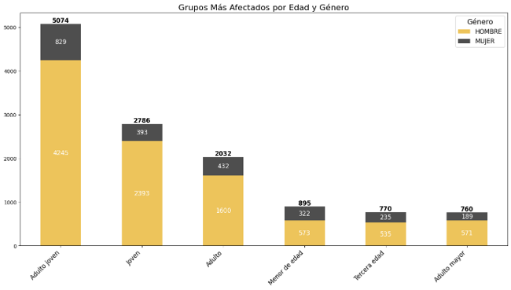
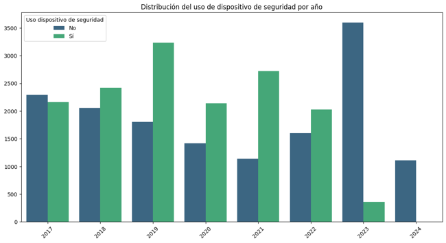
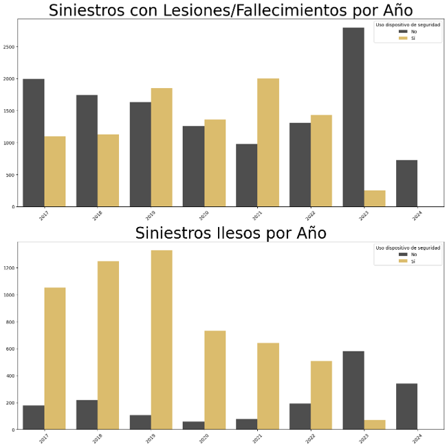
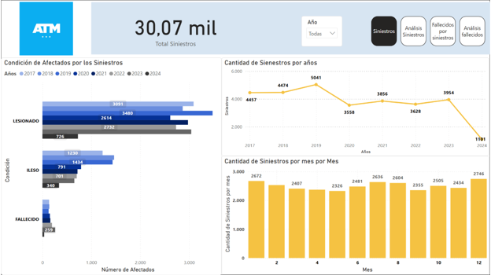
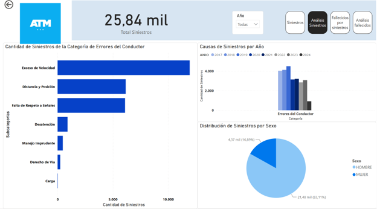
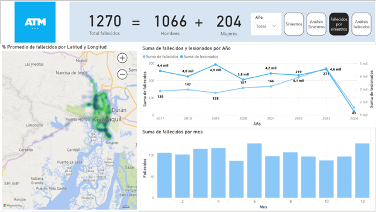
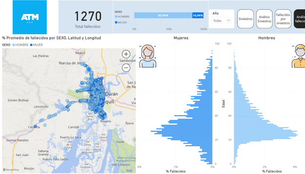

# 📊 Traffic Pattern Analysis – Guayaquil Road Accidents

## 🧠 Project Overview

This project analyzes traffic accident data in Guayaquil, Ecuador, using exploratory data analysis (EDA), geospatial analysis, and data visualization techniques. The goal is to identify accident patterns, high-risk zones, demographic risk factors, and the impact of safety measures such as seatbelts and helmets.

The project combines Python-based analysis (Pandas, GeoPandas, Seaborn, Folium) with Power BI dashboards for interactive reporting.

---

## 🎯 Business Objectives

- Analyze the **trend of traffic accidents over time**
- Identify **high-risk geographic zones in the city**
- Understand **main causes of traffic accidents**
- Profile **most affected demographic groups**
- Evaluate the **impact of safety equipment usage (seatbelts/helmets)**
- Provide insights for **public safety and urban planning decisions**

---

## 🗂️ Dataset Description

- Source: Government traffic accident records (Guayaquil)
- Format: Excel dataset
- Scope: Urban area of Guayaquil
- Key variables:
  - Location (latitude, longitude, canton, parish, zone)
  - Accident details (cause, year, condition)
  - Driver/participant attributes (age, gender, vehicle type)
  - Safety indicators (helmet, seatbelt, holiday indicator)

---

## ⚙️ Data Processing & Engineering

### 🧹 Data Cleaning
- Standardized text fields (capitalization, type casting)
- Handled missing and invalid values (e.g., age = -1)
- Filtered dataset to focus only on **Guayaquil urban area**
- Removed irrelevant or inconsistent records

### 🧠 Feature Engineering
- Age categorization:
  - Minor, Young, Young Adult, Adult, Senior groups
- Vehicle classification:
  - Private, Public Transport, Cargo, Personal Mobility, Emergency
- Cause classification using external mapping dataset
- Created binary safety usage variable (helmet/seatbelt usage)

---

## 🌍 Geospatial Analysis

- Converted dataset into a **GeoDataFrame using GeoPandas**
- Spatial join with INEC zone shapefiles
- Aggregated accidents per geographic zone
- Built interactive map using **Folium Choropleth**
- Exported interactive map as HTML:
  - `mapa_accidentes_folium.html`

---

## 📈 Exploratory Data Analysis (EDA)

### 📊 Time Series Analysis
- Accident trends over multiple years
- Line and bar charts showing yearly variation

### 🧭 Geographic Hotspots
- Identification of high-accident zones
- Spatial distribution of incidents across Guayaquil

### ⚠️ Causes of Accidents
- Top accident categories and subcategories
- Focus on driver-related errors as dominant cause

### 👥 Demographic Analysis
- This analysis identifies the population groups most affected by traffic accidents based on age and gender distribution.

### 🦺 Safety Equipment Impact
- This visualization shows the evolution of seatbelt and helmet usage across different years.

- This analysis compares accident outcomes (injured/fatal vs uninjured cases) in relation to safety device usage.

---

## 📊 Tools & Technologies

- Python
- Pandas / NumPy
- Matplotlib / Seaborn
- GeoPandas
- Folium (interactive maps)
- Shapely
- Power BI (dashboard visualization)
- Excel (data source)

---

## 📊 Power BI Dashboard

An interactive Power BI dashboard was developed to complement the Python analysis, including:

- Accident trends over time
- Geographic heatmaps
- Cause distribution
- Demographic filters (age/gender)
- Safety equipment impact analysis

### 📍 Siniestros Dashboard
Overview of total accidents, trends, and general KPIs.

### 📊 Accident Analysis Dashboard
Detailed breakdown of accident patterns, trends, and distributions.

### ⚠️ Fatality Dashboard
Analysis focused on fatalities and severe outcomes.

### 🧠 Fatality Deep Analysis
In-depth exploration of factors contributing to fatal accidents.

---

## 📌 Key Insights

- Accident distribution is not uniform; certain zones concentrate most incidents
- Driver-related errors are the leading cause of accidents
- Young adults and working-age groups are most affected
- Safety equipment usage shows observable differences in severity outcomes
- Strong spatial correlation exists between location and accident frequency

