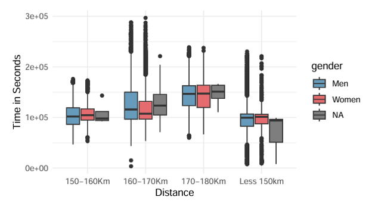
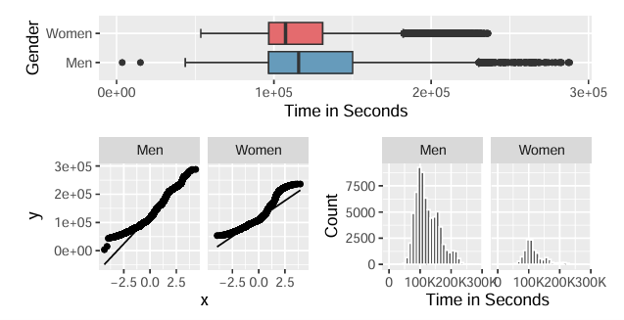
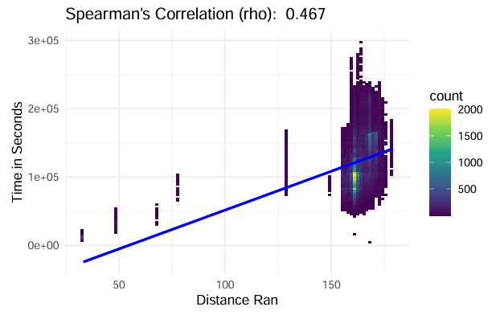

# 🏃‍♂️ Ultra-Trail Running Statistical Analysis (R Project)

## 📌 Project Overview

This project is a **statistical analysis of ultra-trail running performance data** from the International Trail Running Association (ITRA), implemented entirely in **R**.

The objective is to study how **age, gender, and race distance** influence race completion and performance time using **inferential statistical methods and exploratory data analysis (EDA)**.

---

## 🎯 Motivation

Ultra-trail running is a rapidly growing endurance sport. Understanding performance patterns helps to:

- Analyze athlete behavior across demographics  
- Support race organizers with data-driven insights  
- Identify factors influencing race completion  
- Explore relationships between endurance and race characteristics  

This study focuses on three core research questions:

- Does age affect race completion?  
- Do men and women differ in performance time?  
- Is race distance related to completion time?  

---

## 📊 Dataset

- **Source:** International Trail Running Association (ITRA)
- **Time period:** 2012–2021
- **Scale:**
  - ~1,200 races
  - ~137,000+ runners

### Variables:
- Age  
- Gender  
- Race distance  
- Finish time (seconds)  
- Completion status  

---

## ⚙️ Data Processing

The dataset required extensive preprocessing in **R**:

- Merging datasets using `race_year_id`
- Handling missing values (non-finishers identified via NA values)
- Removing invalid records (e.g., age = 0 or > 90)
- Creating engineered variables:
  - Age groups (categorical bins)
  - Distance categories
  - Finish status indicator

Outliers were removed to ensure validity of statistical assumptions.

---

## 📊 Exploratory Data Analysis (EDA)

Key insights from the analysis:

- Most participants are aged **40–50 years**
- Strong male dominance in participation (~84%)
- Mid-distance races (160–170 km) show highest engagement
- Non-normal distributions observed in key variables

One of the first insights was the relationship between race distance, gender, and completion time.

Figure 1 shows the distribution of completion times across different distance categories segmented by gender.

*Time (s) to complete the race by gender and distance category*
---

## 🧠 Methodology (R Implementation)

All analyses were performed in **R**, using statistical libraries.

### 📌 1. Chi-Square Test of Independence
- **Purpose:** Test relationship between age group and race completion  
- Variables:
  - Age group (categorical)
  - Finish status (categorical)

---

### 📌 2. Independent Samples t-Test (Welch)
- **Purpose:** Compare performance time between men and women  
- Variables:
  - Gender
  - Time in seconds  
- Notes:
  - Welch correction applied due to unequal variances  
  - Large sample size supported CLT assumptions  

---

### 📌 3. Spearman Correlation
- **Purpose:** Measure relationship between race distance and finish time  
- Variables:
  - Distance (ordinal)
  - Time (numeric)  

---

## 📈 Key Results

### 📌 Age vs Race Completion
- Significant association (p < 0.05)
- Age influences race completion behavior
- Middle-aged groups (40–60) show higher completion rates

---

### 📌 Gender vs Performance Time
- Statistically significant difference observed
- Women performed faster in 160–170 km category
- Welch t-test confirmed unequal variance between groups

---

### 📌 Distance vs Time
- Moderate positive correlation (Spearman ρ ≈ 0.47)
- Longer races generally increase completion time
- Relationship is not strictly linear

---

## 📊 Visualizations

To validate assumptions for the independent t-test, the distribution of completion times was analyzed.

Time in Seconds - Distribution*

A Spearman correlation was applied due to non-normal distributions and ordinal structure of distance.

The relationship between distance and completion time is shown below:

*Figure 3: Visualization of Spearman’s Correlation (ρ)*

---

## ⚙️ R Packages Used

- tidyverse  
- ggplot2  
- dplyr  
- rstatix  
- broom  
- corrplot  
- psych  
- janitor  
- patchwork  

---

## 📌 Key Takeaways

- Age significantly impacts race completion probability  
- Gender differences exist in ultra-distance performance  
- Distance is moderately correlated with finish time  
- Ultra-trail performance is influenced by multiple demographic factors  

---

## ⚠️ Limitations

- Convenience sample (not fully random)
- Missing values interpreted as non-completions in some cases
- Presence of extreme outliers in raw dataset
- Non-normal distributions in key variables

---

## 🚀 Future Work

- Survival analysis for race completion probability
- Mixed-effects models for athlete-level variation
- Inclusion of environmental conditions (weather, elevation)
- Expansion to multi-year comparative performance trends

