# 🏭 IoT Smart Warehouse Access & Inventory Control System

An IoT-based smart warehouse management system designed to improve **security, traceability, and inventory control** in industrial environments. The system replaces manual paper-based processes with a fully digital solution integrating **biometrics, RFID, computer vision, and real-time cloud synchronization**.

---

## 📌 Overview

This project was developed as a thesis to optimize warehouse operations in a high-value spare parts environment.

It focuses on:
- Secure and automated access control
- Real-time inventory tracking
- Reduction of human error in warehouse records
- Full traceability of personnel and material movement

The system integrates **IoT hardware + cloud software + automation mechanisms** into a unified platform.

---

## ⚙️ Key Features

### 🔐 Access Control
- Fingerprint authentication for authorized personnel
- RFID-based entry system
- Role-based access (Admin / Operator)
- Automated door control using a linear actuator

### 📸 Monitoring & Security
- Camera captures entry events automatically
- Laser barrier sensor counts entries/exits
- Real-time alerts for suspicious activity

### 📦 Inventory Management
- QR-based product identification system
- Automated stock updates in real time
- Digital replacement of paper-based withdrawal orders

### ☁️ Cloud Integration
- Firebase Realtime Database
- Instant synchronization across devices
- Centralized logging of warehouse activity

### 🔔 Notifications
- Alerts for:
  - Unauthorized access attempts
  - Multiple-entry detection
  - Low / zero stock events

---

## 🧠 System Architecture

### Hardware Layer
- Raspberry Pi 3 B+
- RFID Reader
- Fingerprint Sensor
- Laser Barrier Sensor
- Camera Module
- Linear Actuator (door mechanism)

### Processing Layer
- Python-based control system
- Sensor validation logic
- Event handling and automation

### Cloud Layer
- Firebase Realtime Database
- Inventory records
- Access logs
- Image storage references

---

## 🏗️ Mechanical Design

- Door automation using a **linear actuator system**
- Designed based on force, torque, and displacement calculations
- Optimized for industrial warehouse door dimensions
- Safety-aware opening mechanism

---

## 💻 Software Components

- Python (core IoT logic)
- Firebase integration (real-time data sync)
- QR-based inventory application
- User system:
  - Admin (full control)
  - Operator (limited permissions)

---

## 🧪 System Workflow

1. User requests entry via RFID or fingerprint
2. System validates identity against database
3. Door opens automatically using actuator
4. Camera captures entry image
5. Laser sensor tracks entry count
6. Event is logged in Firebase
7. Inventory updates in real time via QR system

---

## 📊 Results & Impact

- Reduced inventory inconsistencies
- Improved traceability of warehouse operations
- Faster and safer access during night shifts
- Elimination of manual paper-based workflows
- Increased operational transparency and security

---

## 🚀 Future Improvements

- AI-based anomaly detection inside warehouse
- Computer vision for object recognition
- Predictive inventory forecasting using ML
- Admin dashboard for access control management
- Replacement of hinged door with sliding mechanism

---

## 📷 System Preview

A visual demonstration of the IoT warehouse access and inventory control system, including hardware prototype, software application, and cloud integration.

---

### 🧠 System Architecture

High-level architecture of the IoT system showing hardware, software, and cloud integration.

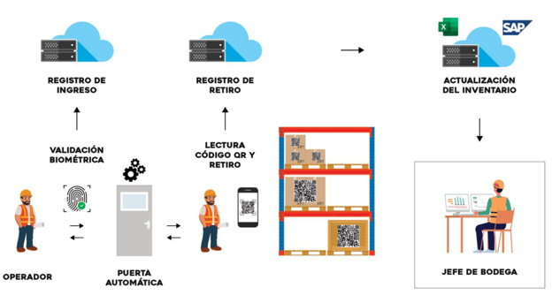
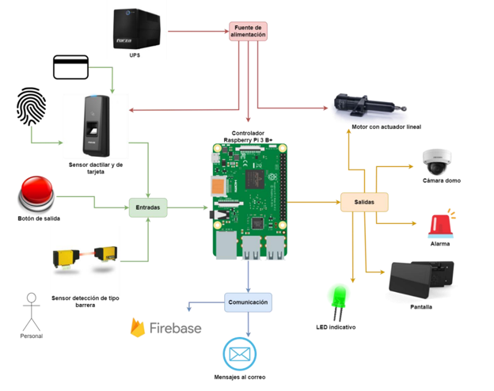

---

### 🔐 Access Control System

RFID and fingerprint-based authentication used for secure warehouse entry.

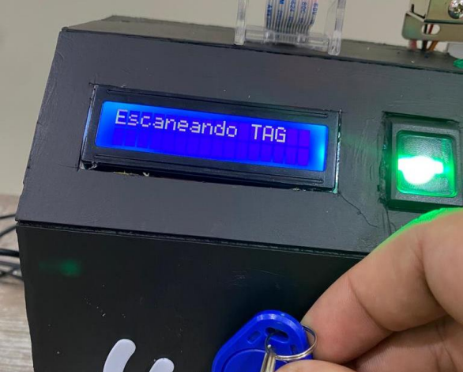
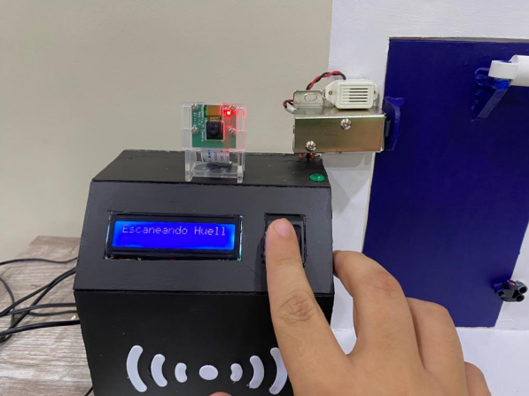

---

### 🏗️ Prototype Implementation

Physical implementation of the automated warehouse access system.

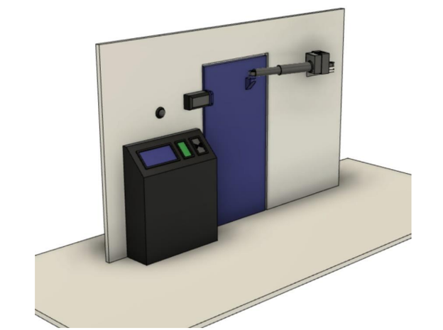
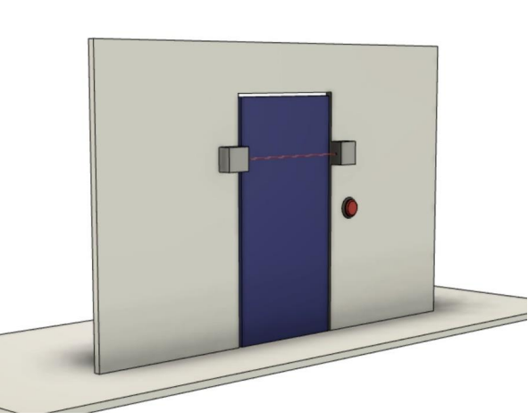

---

### 📦 Inventory Management System (GIF Demo)

QR-based inventory system with real-time stock updates.

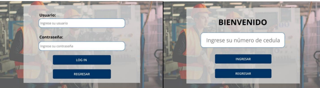
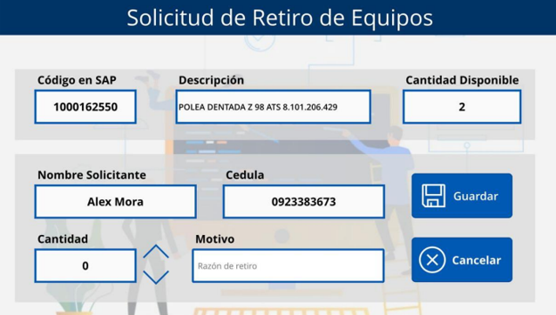

---

### ☁️ Cloud & Database System

The system uses Firebase Realtime Database to enable instant synchronization of warehouse events, inventory updates, and access logs across all connected devices.

A comparison between Firebase and traditional relational databases highlights the advantages of real-time synchronization and scalability in IoT environments.

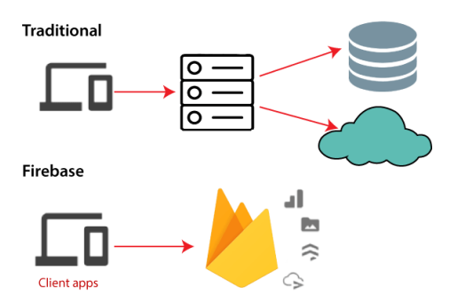

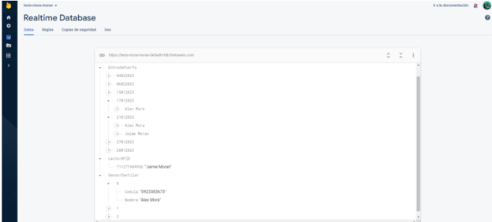
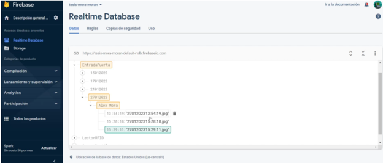
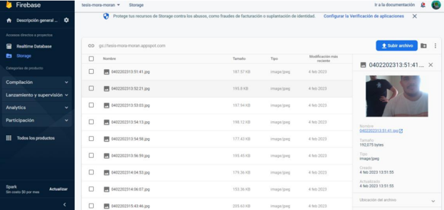

---

### 📸 Monitoring & Security System

Automated camera capture and alert system for warehouse entry monitoring.

